# Document Portal

A RAG (Retrieval-Augmented Generation) based application for intelligent document analysis and management. This portal enables users to interact with documents through natural language queries, compare multiple documents, and perform advanced document analysis.

## Project Overview

This project implements a comprehensive RAG-based document portal with the following architecture:

### RAG Architecture
- **Development Phase**: Document ingestion, processing, and RAG pipeline development
- **Deployment Phase**: Production-ready document analysis and query system

### Core Features

#### 📄 Document Analysis
1. **Single Document Chat**: Interactive conversations with individual documents
2. **Document Comparison**: Side-by-side analysis and comparison of multiple documents
3. **Multi-Document Chat**: Query across multiple documents simultaneously
4. **Advanced Document Processing**: Intelligent document parsing and analysis

#### 🔧 Technology Stack
- **LangChain**: Framework for building LLM applications
- **LangSmith**: Development and monitoring platform
- **Streamlit**: Web application interface
- **Python**: Core development language

### Architecture Components

```mermaid
graph TD
    A[Project: RAG-based Application] --> B[RAG Architecture]
    B --> C[Development Phase]
    B --> D[Deployment Phase]
    
    C --> E[Document Ingestion]
    C --> F[Vector Store Creation]
    C --> G[RAG Pipeline Development]
    
    D --> H[Doc-Portal]
    
    H --> I[📊 Analysis and Doc]
    H --> J[🔍 Compare Documents]
    H --> K[💬 Talk with Single Doc]
    H --> L[🗣️ Talk with Multiple Documents]
    
    I --> M[Document Processing]
    I --> N[Key Insights Extraction]
    
    J --> O[Side-by-Side Analysis]
    J --> P[Similarity Detection]
    
    K --> Q[Interactive Q&A]
    K --> R[Contextual Responses]
    
    L --> S[Cross-Document Queries]
    L --> T[Knowledge Base Chat]
    
    M --> U[LangChain]
    N --> U
    O --> U
    P --> U
    Q --> U
    R --> U
    S --> U
    T --> U
    
    U --> V[LangSmith Monitoring]
    U --> W[Streamlit Interface]
    
    style A fill:#e1f5fe
    style H fill:#f3e5f5
    style U fill:#e8f5e8
    style V fill:#fff3e0
    style W fill:#fce4ec
```



#### System Flow Overview

```mermaid
flowchart LR
    subgraph "Input Layer"
        A[📄 Documents] 
        B[👤 User Queries]
    end
    
    subgraph "Processing Layer"
        C[Document Parser]
        D[Vector Database]
        E[RAG Engine]
        F[LLM Model]
    end
    
    subgraph "Application Layer"
        G[Analysis Module]
        H[Comparison Module]
        I[Chat Module]
    end
    
    subgraph "Interface Layer"
        J[Streamlit UI]
        K[API Endpoints]
    end
    
    subgraph "Monitoring Layer"
        L[LangSmith]
        M[Performance Metrics]
    end
    
    A --> C
    C --> D
    B --> E
    D --> E
    E --> F
    F --> G
    F --> H
    F --> I
    G --> J
    H --> J
    I --> J
    J --> K
    E --> L
    F --> L
    L --> M
    
    style A fill:#e3f2fd
    style B fill:#e3f2fd
    style D fill:#f1f8e9
    style E fill:#fff3e0
    style F fill:#fce4ec
    style J fill:#f3e5f5
    style L fill:#e8eaf6
```



## Setup

1. Clone this repository:
   ```bash
   git clone https://github.com/joshfpedro/document-portal.git
   cd document-portal
   ```

2. Create a virtual environment:
   ```bash
   python -m venv env
   ```

3. Activate the virtual environment:
   - **Windows**: `env\Scripts\activate`
   - **macOS/Linux**: `source env/bin/activate`

4. Install dependencies:
   ```bash
   pip install -r requirements.txt
   ```

5. Set up environment variables:
   ```bash
   cp .env.example .env
   # Edit .env with your API keys and configuration
   ```

## Usage

### Running the Application
```bash
streamlit run app.py
```

### User Journey


### Features Available

#### 1. Document Analysis
- Upload and analyze individual documents
- Extract key insights and summaries
- Interactive Q&A with document content

#### 2. Document Comparison
- Upload multiple documents for comparison
- Side-by-side analysis
- Identify similarities and differences

#### 3. Single Document Chat
- Natural language conversations with a single document
- Ask questions and get contextual answers
- Explore document content interactively

#### 4. Multi-Document Chat
- Query across multiple documents simultaneously
- Cross-reference information between documents
- Comprehensive knowledge base interactions

## Project Structure

```
document-portal/
├── app.py                 # Main Streamlit application
├── src/
│   ├── rag/              # RAG implementation
│   ├── document_processing/  # Document handling
│   ├── chat/             # Chat functionality
│   └── comparison/       # Document comparison
├── config/               # Configuration files
├── data/                # Document storage
├── tests/               # Test suite
└── requirements.txt     # Python dependencies
```

## Development

### RAG Pipeline Development


The development phase focuses on:
- Document ingestion and preprocessing
- Vector store creation and management
- LLM integration and prompt engineering
- Evaluation and testing of RAG performance

### Deployment
The deployment phase includes:
- Production-ready RAG pipeline
- Scalable document processing
- User interface optimization
- Performance monitoring with LangSmith

## Contributing

1. Fork the repository
2. Create a feature branch (`git checkout -b feature/amazing-feature`)
3. Commit your changes (`git commit -m 'Add some amazing feature'`)
4. Push to the branch (`git push origin feature/amazing-feature`)
5. Open a Pull Request

## Technology Details

- **LangChain**: Powers the RAG pipeline and LLM interactions
- **LangSmith**: Provides development tools and monitoring
- **Streamlit**: Creates the interactive web interface
- **Vector Databases**: For efficient document retrieval
- **Python Ecosystem**: Leverages pandas, numpy, and other data science libraries

## License

This project is licensed under the MIT License - see the LICENSE file for details.

## Support

For questions and support, please open an issue in the GitHub repository.
